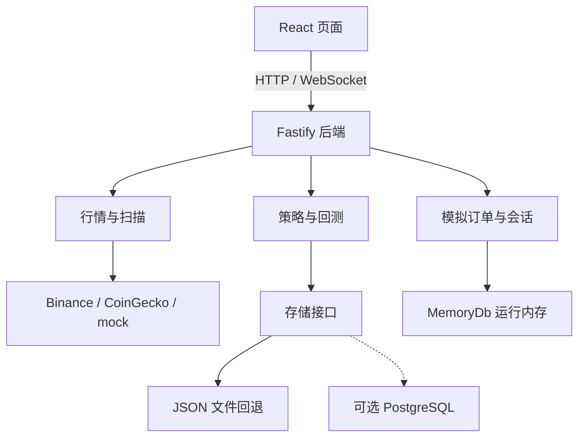

# TradeLab · 策略构建、历史回测与模拟订单

**TradeLab 是一个在你自己电脑上运行的加密货币模拟交易实验台。** 你可以组合技术指标，用历史行情查看结果，再下模拟订单，观察资金与持仓如何变化。

项目想解决的问题是：有一个交易想法之后，怎样把它变成可保存、可比较、可复盘的实验？目前已经有策略构建、回测、行情和模拟订单的主要模块，仍属于开发中的原型。

[快速启动](#快速启动) · [第一次实验](#第一次实验按这个顺序操作) · [计算方法](docs/methodology.md) · [当前边界](#目前做到哪里还有哪些边界) · [结构改善清单](docs/project-review.md)

## 工作原理：从配置到结果

项目有两个实验模块：**历史回测**接收策略配置，计算历史信号与权益；**模拟订单**接收你手动提交的买卖请求，更新模拟账户。两者目前使用不同的计算逻辑，回测不会自动触发模拟下单。

下面三张方法图按当前代码绘制：实线箭头表示处理顺序，图 2 的点线连接流程与数学定义。图中的公式描述现有实现；结果是否可信，还取决于图下注明的方法边界。完整定义与源码入口见 [计算方法](docs/methodology.md)。

### 图 1：策略配置怎样变成计算权重


你先选择指标、调整权重，也可以让 AI 提出建议，再由你检查和保存。保存的是一份配置。回测读取指标的类别和标签，将它们映射到**趋势、动量、均值回归、波动率、成交量、市场结构**六个因子；一个指标命中多个因子时会平均分摊权重，未出现的因子补默认权重，最后归一化。

这意味着：目前选择某个指标，并不等于回测逐项执行该指标的原始公式。AI 给出的评分也不是历史收益。

[查看矢量图](docs/assets/method-strategy.svg) · [权重映射的详细定义](docs/methodology.md#1-策略配置与因子权重)

### 图 2：历史行情怎样变成回测结果


K 线包含开盘、最高、最低、收盘价和成交量（OHLCV）。系统从历史 K 线计算六个因子的分数，再按图 1 的权重求和，得到信号 **S**。信号超过正阈值时做多、低于负阈值时做空，其余时点空仓。

每根 K 线的收益由**上一根的持仓方向**和本根价格变化决定；持仓切换扣除固定成本，再累计成权益 **E**，也就是模型计算出的账户价值。输出包括单币和组合曲线、回撤、Sharpe、持仓 K 线胜率及持仓切换次数，并保存参数快照和回测历史。

**当前方法有三个明显限制：**阈值从整个历史样本估算，包含未来信息；权益被人为限制在初始资金的 20% 以上；多币种曲线按尾部长度截齐、按索引平均，尚未严格按时间戳对齐。因此这些结果适合检查原型机制，尚不能作为严格的策略效果验证。

[查看矢量图](docs/assets/method-backtest.svg) · [六因子公式、阈值和统计口径](docs/methodology.md#2-历史回测)

### 图 3：模拟订单怎样改变账户


你在 Orders 页面提交订单后，系统读取行情与账户，检查价格及风控规则。通过后，**市价单按当前报价立即全量模拟成交**，更新现金、持仓和成交记录；**限价单只保持挂单状态，可由用户取消，当前没有自动撮合**。风控拒绝发生在创建订单之前。

运行会话可以关联策略与订单，但目前只管理会话状态和初始资金，没有持续读取策略信号、自动生成订单的执行循环。模拟成交不会向交易所提交真实订单，订单及会话账本目前保存在内存。

[查看矢量图](docs/assets/method-orders.svg) · [订单分支与源码入口](docs/methodology.md#3-模拟订单与运行会话)

## 快速启动

需要 Git、npm 和兼容 Vite 8 的 Node.js；例如 Node 22.12+ 或受支持的更高版本，见 [Vite 官方要求](https://vite.dev/guide/)。

### 1. 下载并安装

在终端执行：

```bash
git clone https://github.com/clayzhao123/tradelab.git
cd tradelab
npm ci
```

已有仓库时，进入它的根目录后执行 `npm ci`。

### 2. 复制配置

macOS / Linux：

```bash
cp backend/.env.example backend/.env
cp frontend/.env.example frontend/.env
```

Windows PowerShell：

```powershell
Copy-Item backend/.env.example backend/.env
Copy-Item frontend/.env.example frontend/.env
```

打开 `backend/.env`，首次演示将下面三项设为：

```dotenv
HOST=127.0.0.1
DATABASE_URL=
MARKET_DATA_PROVIDER=mock
```

其他项保留默认值。`frontend/.env` 的 API/WS 地址留空即可，开发服务器会代理到本机后端。这样先用模拟行情跑通流程，不需要数据库或 AI 密钥。

### 3. 启动并打开页面

在仓库根目录执行：

```bash
npm run dev
```

这条命令同时启动前后端。打开终端显示的前端地址，默认是 **http://localhost:5173**。后端健康检查为 http://localhost:3001/health。

启动后应能看到 Dashboard 和行情数据。此时配置为 `mock`，显示的是演示数据。若页面有错误，先检查后端健康地址；其他排查步骤见 [运行手册](docs/runbook.md)。

## 第一次实验：按这个顺序操作

### 1. 手动建立一个策略

打开 **Strategy Lab**（`/strategy`），选择至少两个指标，例如各选一个趋势类和动量类指标；调整权重，使总和为 100%，命名并保存。

策略有两条构建路径：

- **手动组合**：你自己选择指标和权重，不需要 AI。
- **AI 辅助**：在页面保存 MiniMax 的 model 和 API key，再按文字描述或已选指标生成建议；检查结果，应用到草稿，然后保存。

AI 输出的评分和雷达图是模型的建议性评价，**不是回测成绩**。保存后，按照图 1 的方式映射为六因子权重；实现细节见 [计算方法](docs/methodology.md)。

### 2. 跑一次历史回测

打开 **Backtest**（`/backtest`），选择刚保存的策略，先选少量币种，使用日线、中性模式和页面默认的回看区间及模拟资金，再运行回测。

优先看三件事：权益曲线如何变化、最大回撤有多大、持仓切换有多频繁。页面的“交易次数”实际统计持仓切换次数，“胜率”实际统计持仓 K 线的盈利比例，二者均不是逐笔平仓交易统计。回看区间按 K 线根数配置，例如日线 365 根约对应一年，实际可用长度取决于数据来源。

回测页支持历史记录、结果详情和多次结果比较。回测结果保存在该页的历史中；`/history` 主要查看运行会话，二者不是同一类记录。

### 3. 观察模拟订单与会话

| 页面 | 操作 | 可以观察什么 |
|---|---|---|
| Bot Runner（`/runner`，可选） | 选择策略与初始模拟资金，开始会话 | 当前运行状态；同时仅允许一个 active run |
| Orders（`/orders`） | 选择币种、BUY/SELL、类型和数量后创建订单 | MARKET 立即模拟成交；LIMIT 仅挂单，可取消；数量是币的数量，不是 USDT 金额 |
| Dashboard（`/`） | 查看账户与行情面板 | 现金、持仓及账户变化 |
| Bot Runner / History（`/history`） | 停止会话，再查看相关记录 | 会话、成交与事件记录 |

Runner 的按钮目前叫 “DEPLOY & START BOT”，实际后端实现的是**会话开始/停止及状态管理**，尚未接上按策略持续自动下单的完整执行循环。未创建会话时，也可以从 Orders 创建手动模拟订单。

## 目前做到哪里，还有哪些边界

| 当前状态 | 对使用者意味着什么 |
|---|---|
| 策略、回测、行情、模拟订单和会话模块已实现 | 可以开展本地实验；本 README 不据此宣称已有经过长期验证的盈利策略 |
| 默认 `real` 模式使用 Binance 行情及 CoinGecko 市值信息 | 首次运行建议明确设为 `mock`；真实请求失败时可能使用缓存或模拟回退 |
| 策略、AI 设置、回测历史有文件回退存储 | 非测试环境写入 `backend/.data/`；AI 设置可能包含密钥，不应提交或分享 |
| 订单、成交、账户、运行会话仍在内存 | 后端重启后，这些状态不会像文件数据一样保留 |
| PostgreSQL repository 已有代码，`pg` 依赖尚未声明 | 填写 `DATABASE_URL` 不等于已经启用数据库，需补齐依赖、迁移并验证 |
| 回测实现仍需要方法校验 | 全样本阈值、20% 权益下限和组合索引对齐会影响解释；“年线”映射为月线请求，时间口径也需要修正 |
| 回测与模拟订单未共享一个执行引擎 | 回测切换成本系数为 0.00055；市价模拟成交手续费率为 0.0006，不能直接比较为同一种执行结果 |

这些限制及改进顺序见 [结构与维护审查](docs/project-review.md)。

## 想继续开发，从哪里开始

当前有两个 npm workspace：`frontend/` 是界面，`backend/` 是 API 和业务逻辑。**`frontend_module/` 是原始设计参考，不是当前应用入口。**

| 位置 | 放什么 | 什么时候看 |
|---|---|---|
| [frontend/](frontend/README.md) | 页面、图表、界面交互 | 修改页面或使用体验 |
| [backend/src/modules/](backend/src/modules/) | 行情、策略、回测、订单、会话等模块 | 修改业务行为 |
| [backend/src/repositories/](backend/src/repositories/) | 策略、AI 设置、回测历史的存储实现 | 修改保存方式 |
| [database/](database/) | PostgreSQL schema、迁移和 seed | 准备启用数据库 |
| [docs/](docs/README.md) | 运行、设计、接口和维护说明 | 查找项目知识 |
| [scripts/v1-smoke.mjs](scripts/v1-smoke.mjs) | HTTP/WebSocket 基本流程检查 | 检查前后端联通 |
| [frontend_module/](frontend_module/README.md) | 原始 Figma 设计代码 | 查阅历史设计 |
| `memory/`、`skill/` | 开发交接与协作记录 | 恢复开发背景；不代表功能已完成 |

技术栈：React 19、TypeScript 5.9、Vite 8、Tailwind CSS 4；后端 Fastify 5，自定义 WebSocket 网关。

上面的三张方法图解释计算逻辑；下面的结构图用于定位代码和数据存储：



## 修改后怎样检查

在根目录执行：

```bash
npm test
npm run build
npm run lint --workspace frontend
```

后端已启动时，另开终端执行 `npm run smoke:v1`。测试结果应记录在对应 PR；基本流程通过不等于策略有效性已验证。

更多说明：[计算方法](docs/methodology.md) · [运行手册](docs/runbook.md) · [开发与接口参考](docs/developer-reference.md) · [结构改善清单](docs/project-review.md) · [文档索引](docs/README.md) · [方法图维护](docs/assets/README.md)。
