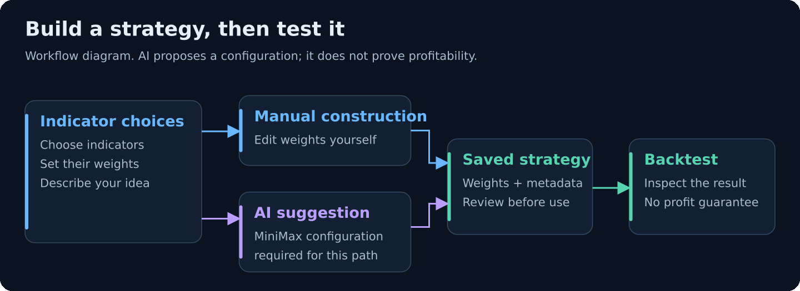
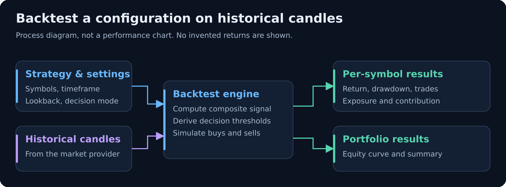
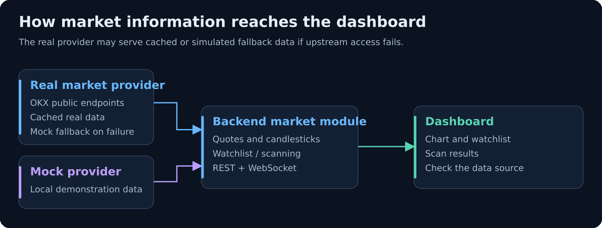
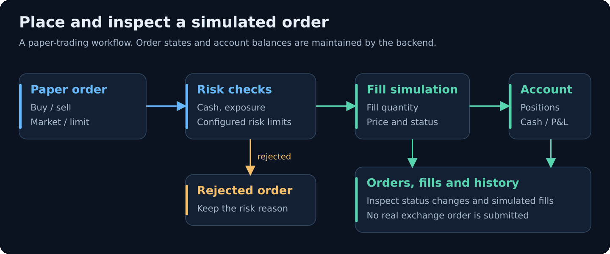
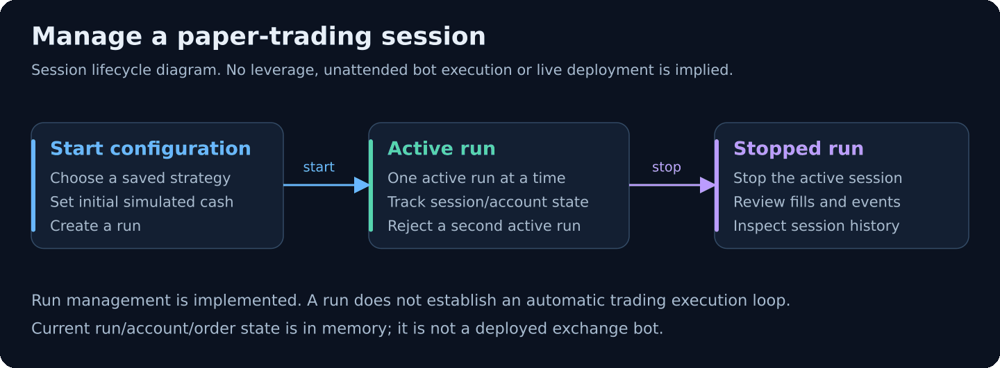
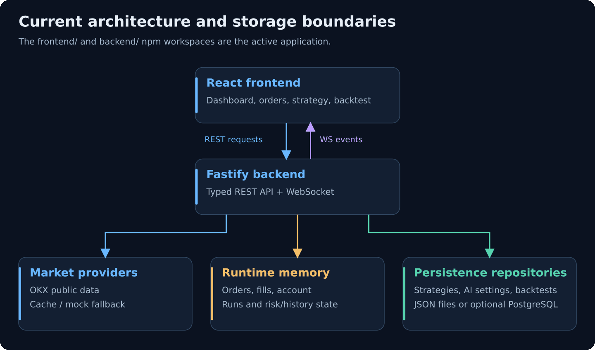

# TradeLab · 加密货币模拟交易实验台

TradeLab 是一个本地运行的 Web 项目：查看行情、组合技术指标、用历史 K 线回测，再通过模拟订单观察账户变化。它的目的，是让策略想法有一个可以配置、运行和复盘的实验环境。

**当前状态：开发中的实验原型。** 行情可来自 OKX 公共接口，交易成交由本地模拟；当前没有向交易所提交真实订单的执行接口。AI 可以提供策略配置建议，效果需要回测与进一步验证。

## 能做什么

| 功能 | 通俗解释 | 当前边界 |
|---|---|---|
| 行情与扫描 | 看价格、K 线、观察列表和扫描结果 | 可用真实或 mock 数据；上游失败时可能回退缓存或模拟数据 |
| 策略实验室 | 选择指标、分配权重，保存组合方案 | AI 建议需要配置 MiniMax；手动配置不依赖 AI |
| 历史回测 | 把策略放到历史 K 线上，看交易与权益变化 | 输出单币与组合分析，不代表未来收益 |
| 模拟订单 | 创建买卖订单，观察成交、持仓和现金 | 支持 market / limit 和风险检查；不是实盘交易 |
| 运行会话 | 开始、停止一次实验，再查看历史 | 当前一次只允许一个 active run；不能据此宣称已实现自动交易 Bot |

下方图片是**根据当前代码绘制的功能/架构说明图**，不是应用截图、实时行情或收益报告。README 使用 PNG 显示；每张图都保留 SVG 源文件，便于修改。

## 1. 构建策略：手动配置或 AI 建议

先选择指标和权重，也可以让 AI 根据描述或已选指标提出组合建议；检查配置后保存，再去回测。



[查看 SVG 源图](docs/assets/strategy-fusion.svg)

指标目录包括趋势、动量、波动率、成交量等类别。AI 输出配置建议和说明，不是“已经验证的高性能策略”。回测端会把指标的标签/类别映射为核心因子权重，具体机制见 [策略融合说明](docs/strategy-fusion-core-2026-04-04.md)。

## 2. 回测：看实际运行结果

选择策略、币种、时间框架与回看区间，查看收益、回撤、交易次数、暴露和组合权益等结果。回测支持 aggressive / neutral / conservative 决策强度。



[查看 SVG 源图](docs/assets/backtest-flow.svg)

收益率、胜率和回撤应以你实际运行的回测结果为准。回测自动阈值的实现也不表示运行会话已经复用同一套自动执行逻辑。

## 3. 行情：区分真实来源与演示来源

MARKET_DATA_PROVIDER=real 使用 OKX 公共行情；mock 使用本地模拟数据。真实源请求失败时，相关接口可能先用缓存，再回退 mock，因此不能仅凭“页面有价格”认定它是当前真实行情。



[查看 SVG 源图](docs/assets/market-data.svg)

## 4. 模拟订单：检查账户如何变化

创建订单后，后端执行风险检查和模拟成交，并更新订单、成交、持仓与现金。可查看 new、open、partial、filled、cancelled、rejected 等状态。



[查看 SVG 源图](docs/assets/paper-orders.svg)

## 5. 运行会话：开始、停止、复盘

选择保存的策略和初始模拟资金，开始一次 run；停止后查看相关记录。当前后端实现会话生命周期与状态管理，尚未实现“启动后自动按策略持续下单”的完整执行循环。



[查看 SVG 源图](docs/assets/run-session.svg)

## 先启动一个本地演示

### 准备

使用满足 Vite 8 要求的 Node.js；例如 Node 22.12+ 或受支持的更高版本，要求见 [Vite 官方说明](https://vite.dev/guide/)。安装 Git 和 npm。

```bash
git clone https://github.com/clayzhao123/tradelab.git
cd tradelab
npm ci
```

如果是在已有目录中操作，进入仓库根目录后执行 npm ci 即可。根目录用 npm workspaces 同时管理 frontend/ 与 backend/，不要把 frontend_module/ 当成当前应用。

### 复制配置

macOS / Linux：

```bash
cp backend/.env.example backend/.env
cp frontend/.env.example frontend/.env
```

Windows PowerShell：

```powershell
Copy-Item backend/.env.example backend/.env
Copy-Item frontend/.env.example frontend/.env
```

首次演示建议把 backend/.env 中以下两行设为：

```dotenv
DATABASE_URL=
MARKET_DATA_PROVIDER=mock
```

这样可先使用本地模拟行情与文件回退存储，不需要先配置数据库或外部 AI。需要真实行情时改为 real。frontend/.env 的 API/WS 地址可以留空，开发服务器会代理到本机 3001 端口。

### 启动

在仓库根目录运行：

```bash
npm run dev
```

这条命令同时启动前后端。浏览器打开终端显示的前端地址，默认是 [http://localhost:5173](http://localhost:5173)；后端健康检查为 [http://localhost:3001/health](http://localhost:3001/health)。

没有根目录 npm start 脚本。需要单独启动时，使用：

```bash
npm run dev --workspace backend
npm run dev --workspace frontend
```

两个命令分别在两个终端执行。后端使用默认端口 3001；若更改它，需要同时修改 frontend/vite.config.ts 的代理目标。

## 第一次使用顺序

1. 在 Dashboard 查看行情，并确认是 mock 演示还是 real 来源。
2. 在 Strategy Lab 手动创建一个组合；需要 AI 时在页面配置 MiniMax provider、model 和 API key。
3. 在 Backtest 选择策略与数据区间，查看结果，不把插图当作实测。
4. 在 Orders 创建模拟订单，观察订单、成交和账户变化。
5. 在 Runner 创建/停止会话，在 History 复盘。

AI 设置的后端路径是 /api/v1/ai/config，生成建议的路径是 /api/v1/ai/fusion/generate。接口 base URL 可通过 MINIMAX_OPENAI_BASE_URL 调整，具体来源示例见 [backend/.env.example](backend/.env.example)。

## 页面导航

| 路径 | 页面 | 作用 |
|---|---|---|
| / | Dashboard | 行情、K 线、观察列表与扫描 |
| /strategy | Strategy Lab | 指标选择、权重与 AI 建议 |
| /backtest | Backtest | 历史回测与结果分析 |
| /orders | Orders | 模拟订单与成交 |
| /runner | Bot Runner | 当前实现为实验会话管理 |
| /history | History | 查看运行记录 |

## 当前系统结构



[查看 SVG 源图](docs/assets/architecture.svg)

| 位置 | 当前用途 |
|---|---|
| frontend/ | 正在使用的 React 前端 |
| backend/ | Fastify API、行情、回测、订单和会话服务 |
| database/ | PostgreSQL schema、迁移与 seed |
| docs/ | 设计、领域说明与运行手册 |
| docs/assets/ | 本 README 的 PNG 图片和 SVG 源文件 |
| scripts/v1-smoke.mjs | HTTP 与 WebSocket 基本流程检查 |
| frontend_module/ | 原始设计参考代码，不属于根目录 npm workspaces |
| memory/、skill/ | 开发交接记录与协作说明，不是运行服务 |

实际技术栈来自当前 package.json：React 19、TypeScript 5.9、Vite 8、Tailwind CSS 4；后端是 Fastify 5。WebSocket 由后端网关实现。

## 哪些数据会保留

存储有两层，不能把“有 database/ 目录”理解成所有业务都已持久化：

| 数据 | 当前存储 |
|---|---|
| 策略、AI provider 设置、回测历史 | 开发模式默认回退到 backend/.data/ JSON 文件；可选 PostgreSQL repository |
| 模拟订单、成交、账户、运行会话及相关运行历史 | 当前 MemoryDb，后端重启后不应期待保留 |
| 测试中的 repository 回退 | 内存，与开发模式文件回退不同 |

PostgreSQL 接口已写在代码中，但 backend/package.json 尚未声明 pg 依赖；只填写 DATABASE_URL 不足以保证启用。要使用它，需要安装 pg、建立数据库并执行迁移，随后确认后端连接日志。AI 设置文件可能包含密钥，.env 和 .data/ 不应提交或分享。

## 配置项

| 配置 | 默认值/用途 |
|---|---|
| HOST / PORT | 0.0.0.0 / 3001，后端监听地址 |
| MARKET_DATA_PROVIDER | real；首次演示可设 mock |
| DATABASE_URL | env.ts 默认空；.env.example 有示例连接串 |
| WS_PATH | /ws |
| WS_HEARTBEAT_INTERVAL_MS | 15000 |
| MINIMAX_OPENAI_BASE_URL | API base，默认值与国内/国际配置见 .env.example |
| VITE_API_BASE_URL / VITE_WS_BASE_URL | 开发时留空可使用 Vite 代理 |

## 常用接口与事件

当前业务 API 前缀是 /api/v1。

| 方法 | 路径 | 用途 |
|---|---|---|
| GET | /health | 健康检查 |
| GET | /api/v1/system/status | 系统状态 |
| GET | /api/v1/market/watchlist | 观察列表 |
| GET | /api/v1/quotes | 行情 |
| GET | /api/v1/klines | K 线，参数见路由 schema |
| GET / POST | /api/v1/strategies | 列出/创建策略 |
| GET / POST | /api/v1/orders | 列出/创建模拟订单 |
| DELETE | /api/v1/orders/:id | 取消订单 |
| GET | /api/v1/fills | 成交 |
| POST | /api/v1/backtest/run | 回测 |
| GET | /api/v1/backtest/history | 回测记录 |
| GET / POST | /api/v1/runs | 列出/开始会话 |
| POST | /api/v1/runs/:id/stop | 停止会话 |

WebSocket 默认为 ws://localhost:3001/ws。先接收 snapshot，再应用 dashboard.updated、order.updated、fill.created、run.updated、account.updated、risk.triggered 等事件。消息结构与重连约定见 [WebSocket 合约](docs/websocket-contract.md)，完整参数以 backend/src/modules/ 下的 *.routes.ts 为准。

## 修改与检查

在仓库根目录运行：

```bash
npm test
npm run build
npm run lint --workspace frontend
```

后端已启动时，可另开终端运行：

```bash
npm run smoke:v1
```

修改功能时，先运行测试与构建，再用 smoke 检查服务之间的基本流程。将实际结果记录在对应 PR，方便下次继续开发。

更多说明：[本地运行手册](docs/runbook.md) · [前端说明](frontend/README.md) · [页面职责](docs/page-semantics.md) · [图示维护方式](docs/assets/README.md)。
