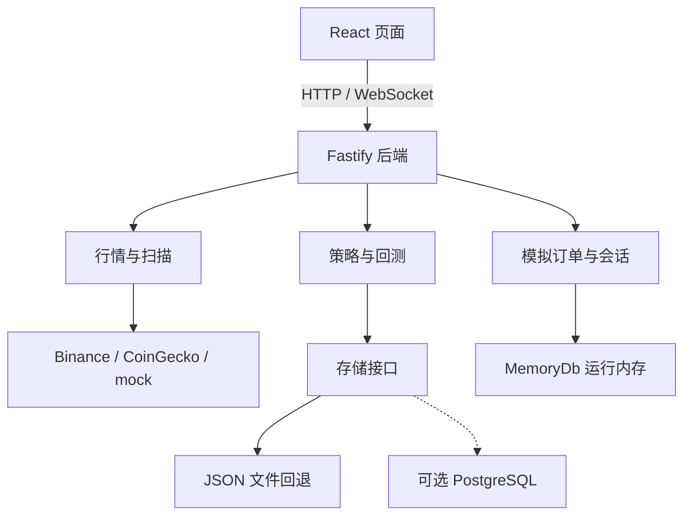

# TradeLab · 把交易想法变成可复盘的实验


**TradeLab 是一个在你自己电脑上运行的加密货币模拟交易实验台。** 你可以组合技术指标，用历史行情查看结果，再下模拟订单，观察资金与持仓如何变化。

项目想解决的问题是：有一个交易想法之后，怎样把它变成可保存、可比较、可复盘的实验？目前已经有策略构建、回测、行情和模拟订单的主要模块，仍属于开发中的原型。

[快速启动](#快速启动) · [第一次实验](#第一次实验按这个顺序操作) · [当前边界](#目前做到哪里还有哪些边界) · [目录导航](#想继续开发从哪里开始) · [结构改善清单](docs/project-review.md)

## 一次实验在做什么


| 阶段 | 你做什么 | 项目给你什么 |
|---|---|---|
| 构建策略 | 选择指标，调整各自的权重，保存一个方案 | 可修改的策略配置 |
| 历史回测 | 选择币种、历史区间和参数，运行实验 | 收益、回撤、权益曲线及单币/组合分析 |
| 模拟交易 | 设置模拟资金，创建买卖订单 | 订单、模拟成交、持仓和会话记录 |

例如，你可以比较同一方案在“中性”和“保守”设置下的结果，检查交易次数与回撤有何变化。**回测与模拟订单是两个独立模块：回测不会替你启动自动交易，模拟成交也不会向交易所提交真实订单。**

> 本页三张图片由图像模型生成，用来解释项目概念；它们不是应用截图，也不包含实测收益。具体操作和已实现能力以正文为准。

## 快速启动

需要 Git、npm 和兼容 Vite 8 的 Node.js；例如 Node 22.12+ 或受支持的更高版本，见 [Vite 官方要求](https://vite.dev/guide/)。

### 1. 下载并安装

在终端执行：

```bash
git clone https://github.com/clayzhao123/tradelab.git
cd tradelab
npm ci
```

已有仓库时，进入它的根目录后执行 `npm ci`。

### 2. 复制配置

macOS / Linux：

```bash
cp backend/.env.example backend/.env
cp frontend/.env.example frontend/.env
```

Windows PowerShell：

```powershell
Copy-Item backend/.env.example backend/.env
Copy-Item frontend/.env.example frontend/.env
```

打开 `backend/.env`，首次演示将下面三项设为：

```dotenv
HOST=127.0.0.1
DATABASE_URL=
MARKET_DATA_PROVIDER=mock
```

其他项保留默认值。`frontend/.env` 的 API/WS 地址留空即可，开发服务器会代理到本机后端。这样先用模拟行情跑通流程，不需要数据库或 AI 密钥。

### 3. 启动并打开页面

在仓库根目录执行：

```bash
npm run dev
```

这条命令同时启动前后端。打开终端显示的前端地址，默认是 **http://localhost:5173**。后端健康检查为 http://localhost:3001/health。

启动后应能看到 Dashboard 和行情数据。此时配置为 `mock`，显示的是演示数据。若页面有错误，先检查后端健康地址；其他排查步骤见 [运行手册](docs/runbook.md)。

## 第一次实验：按这个顺序操作

### 1. 手动建立一个策略

打开 **Strategy Lab**（`/strategy`），选择至少两个指标，例如各选一个趋势类和动量类指标；调整权重，使总和为 100%，命名并保存。


策略有两条构建路径：

- **手动组合**：你自己选择指标和权重，不需要 AI。
- **AI 辅助**：在页面保存 MiniMax 的 model 和 API key，再按文字描述或已选指标生成建议；检查结果，应用到草稿，然后保存。

AI 输出的评分和雷达图是模型的建议性评价，**不是回测成绩**。当前回测会把所选指标的类别/标签映射成六个核心因子；它还不是对指标目录中每个指标原始公式的逐项执行。机制见 [策略融合说明](docs/strategy-fusion-core-2026-04-04.md)。

### 2. 跑一次历史回测

打开 **Backtest**（`/backtest`），选择刚保存的策略，先选少量币种，使用日线、中性模式和页面默认的回看区间及模拟资金，再运行回测。

优先看三件事：权益曲线如何变化、最大回撤有多大、发生了多少次交易。回看区间按 K 线根数配置，例如日线 365 根约对应一年，实际可用长度取决于数据来源。

回测页支持历史记录、结果详情和多次结果比较。回测结果保存在该页的历史中；`/history` 主要查看运行会话，二者不是同一类记录。

### 3. 观察模拟订单与会话

| 页面 | 操作 | 可以观察什么 |
|---|---|---|
| Bot Runner（`/runner`，可选） | 选择策略与初始模拟资金，开始会话 | 当前运行状态；同时仅允许一个 active run |
| Orders（`/orders`） | 选择币种、BUY/SELL、MARKET/LIMIT，输入数量后创建订单 | 风险检查、订单状态与模拟成交；数量是币的数量，不是 USDT 金额 |
| Dashboard（`/`） | 查看账户与行情面板 | 现金、持仓及账户变化 |
| Bot Runner / History（`/history`） | 停止会话，再查看相关记录 | 会话、成交与事件记录 |

Runner 的按钮目前叫 “DEPLOY & START BOT”，实际后端实现的是**会话开始/停止及状态管理**，尚未接上按策略持续自动下单的完整执行循环。未创建会话时，也可以从 Orders 创建手动模拟订单。

## 目前做到哪里，还有哪些边界

| 当前状态 | 对使用者意味着什么 |
|---|---|
| 策略、回测、行情、模拟订单和会话模块已实现 | 可以开展本地实验；本 README 不据此宣称已有经过长期验证的盈利策略 |
| 默认 `real` 模式使用 Binance 行情及 CoinGecko 市值信息 | 首次运行建议明确设为 `mock`；真实请求失败时可能使用缓存或模拟回退 |
| 策略、AI 设置、回测历史有文件回退存储 | 非测试环境写入 `backend/.data/`；AI 设置可能包含密钥，不应提交或分享 |
| 订单、成交、账户、运行会话仍在内存 | 后端重启后，这些状态不会像文件数据一样保留 |
| PostgreSQL repository 已有代码，`pg` 依赖尚未声明 | 填写 `DATABASE_URL` 不等于已经启用数据库，需补齐依赖、迁移并验证 |
| 回测实现仍需要方法校验 | 当前阈值按整个样本估算；“年线”还映射为月线请求，不能把显示标签直接当作严格的时间口径 |

这些限制及改进顺序见 [结构与维护审查](docs/project-review.md)。

## 想继续开发，从哪里开始

当前有两个 npm workspace：`frontend/` 是界面，`backend/` 是 API 和业务逻辑。**`frontend_module/` 是原始设计参考，不是当前应用入口。**

| 位置 | 放什么 | 什么时候看 |
|---|---|---|
| [frontend/](frontend/README.md) | 页面、图表、界面交互 | 修改页面或使用体验 |
| [backend/src/modules/](backend/src/modules/) | 行情、策略、回测、订单、会话等模块 | 修改业务行为 |
| [backend/src/repositories/](backend/src/repositories/) | 策略、AI 设置、回测历史的存储实现 | 修改保存方式 |
| [database/](database/) | PostgreSQL schema、迁移和 seed | 准备启用数据库 |
| [docs/](docs/README.md) | 运行、设计、接口和维护说明 | 查找项目知识 |
| [scripts/v1-smoke.mjs](scripts/v1-smoke.mjs) | HTTP/WebSocket 基本流程检查 | 检查前后端联通 |
| [frontend_module/](frontend_module/README.md) | 原始 Figma 设计代码 | 查阅历史设计 |
| `memory/`、`skill/` | 开发交接与协作记录 | 恢复开发背景；不代表功能已完成 |

技术栈：React 19、TypeScript 5.9、Vite 8、Tailwind CSS 4；后端 Fastify 5，自定义 WebSocket 网关。

当前系统关系如下。插图负责解释概念，这张可编辑结构图负责准确说明代码关系：



## 修改后怎样检查

在根目录执行：

```bash
npm test
npm run build
npm run lint --workspace frontend
```

后端已启动时，另开终端执行 `npm run smoke:v1`。测试结果应记录在对应 PR；基本流程通过不等于策略有效性已验证。

更多说明：[运行手册](docs/runbook.md) · [开发与接口参考](docs/developer-reference.md) · [结构改善清单](docs/project-review.md) · [文档索引](docs/README.md) · [插图与提示词](docs/assets/README.md)。
