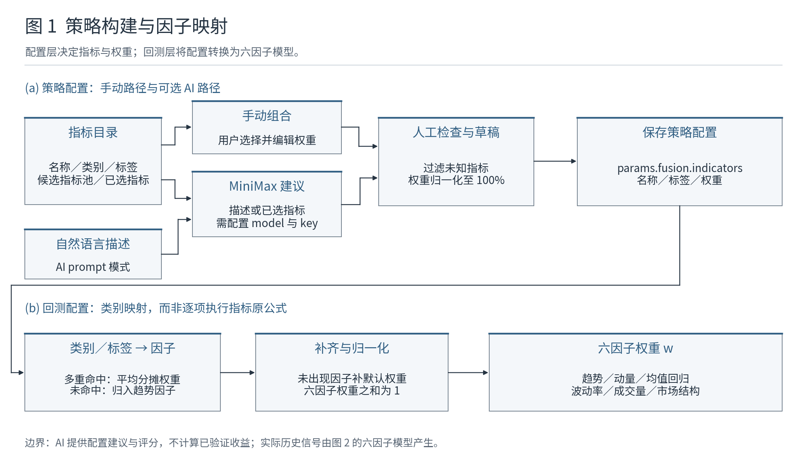
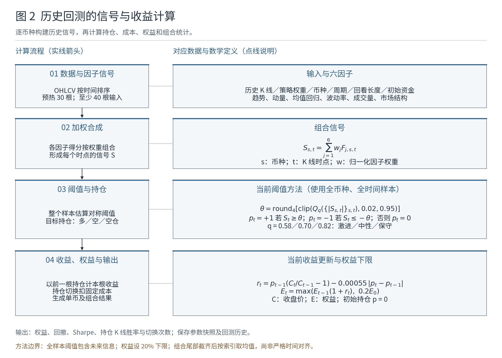
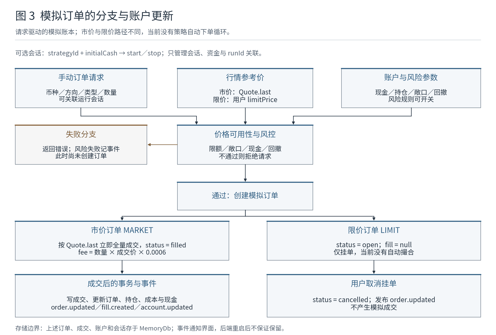

# TradeLab 当前计算方法

这份文档解释现有实现，不是未来设计或策略有效性证明。核对基线为主分支提交 `05fdee7b5ca387203eafdab7c83efab33775851a`；本次只更新文档与方法图，未改变业务算法。阅读概览见 [主 README](../README.md)，图片与重绘方式见 [方法图维护](assets/README.md)。

## 1. 策略配置与因子权重

手动路径由用户选择指标、编辑权重；AI 路径使用 MiniMax，接收自然语言和候选指标池，或已选指标，返回配置建议。后端筛选允许的指标 ID、补齐元数据并归一化，前端再应用到草稿。用户检查后保存。界面要求至少两个指标，权重总和为 100%。AI 评分和雷达值不经过回测计算。

策略保存于 `params.fusion.indicators`，包含指标名称、类别、标签及权重。回测 `deriveFactorWeightsFromStrategy` 读取每项的 `labels` 与 `family`，按照以下表格映射。

| 因子 | 命中的类别／标签 | 默认权重 |
|---|---|---:|
| 趋势 trend | trend、moving-average、breakout、lagging | 0.24 |
| 动量 momentum | momentum、oscillator、leading | 0.22 |
| 均值回归 meanReversion | mean-reversion、reversion、range | 0.16 |
| 波动率 volatility | volatility、risk | 0.14 |
| 成交量 volume | volume、order-flow、liquidity | 0.14 |
| 市场结构 structure | market-structure、support-resistance、regime | 0.10 |

每项权重取非负有限值；命中多个不同因子时均分，未命中时归入 trend。累计后，**未出现的因子使用默认权重，而不是设为零**，然后把六项除以总和。没有策略或没有指标时直接使用默认值。

当前界面的百分制权重直接参与累计，补齐默认值则是上表的小数，两种数值尺度未先统一。例如只映射 trend=50、momentum=50 时，其他四项补值总计 0.54，归一化分母是 100.54。这个行为需要后续明确，而不能假设界面选择等同于完整的六因子权重表。

选了某个具体技术指标，现有回测仍通过其标签决定六因子权重，并不逐项调用目录中每个指标的原始公式。

源码入口：[Strategy.tsx](../frontend/src/app/pages/Strategy.tsx)、[ai.service.ts](../backend/src/modules/ai/ai.service.ts)、[backtest.service.ts](../backend/src/modules/backtest/backtest.service.ts) 中的 `labelToFactor`、`normalizedWeights`、`deriveFactorWeightsFromStrategy`。

## 2. 历史回测

### 输入与采样

请求包含策略、币种、K 线周期、回看根数、初始资金和决策模式。服务将币种去重并限制到 100 个，回看根数限制在 24–2000，初始资金至少 100。逐币种获取 K 线，最多 8 个并行请求；真实行情 provider 单次请求上限为 1000 根。来源可能是真实行情、缓存或 mock，不能只凭页面有曲线判断数据来源。

每个币种独立按开盘时间排序。少于 40 根输入不生成信号；前 30 根用于预热，从索引 30 开始计算。收盘价或上一根收盘价非正时跳过该点。

### 六因子分数

设 $C_t$ 为收盘价，$V_t$ 为成交量，$H_t$、$L_t$ 为最高、最低价；$W_t$ 为从索引 $t-20$ 到 $t$ 的窗口，**包含本根，共 21 根**。代码里的 `mean20`、`high20` 等名称不代表严格 20 根窗口。以下公式省略币种下标。

| 因子 | 当前公式 | 含义 |
|---|---|---|
| 趋势 | $F_{trend,t}=\tanh[36(EMA_{12,t}-EMA_{26,t})/C_t]$ | 两条指数均线的相对差 |
| 动量 | $F_{momentum,t}=\tanh[12(C_t/C_{t-5}-1)]$ | 5 根 K 线价格变化 |
| 均值回归 | $F_{meanReversion,t}=-\tanh[(C_t-\mu_{W_t})/(2.2\sigma_{W_t})]$ | 相对窗口均值的反向偏离 |
| 波动率 | $F_{volatility,t}=1-2\,clip(18ATR_{14,t}/C_t,0,1)$ | 相对波幅越大，得分越低 |
| 成交量 | $F_{volume,t}=\tanh[1.7(V_t/\bar V_{W_t}-1)]$ | 本根成交量相对窗口平均量 |
| 市场结构 | $F_{structure,t}=\tanh[0.9(C_t-(H_{W_t}+L_{W_t})/2)/((H_{W_t}-L_{W_t})/2)]$ | 收盘价在窗口高低区间的位置 |

EMA 的首值是首根收盘价，递推系数为 $2/(n+1)$。标准差使用总体方差；均值回归分母中的标准差、成交量均值和结构因子的高低价差均至少取 $10^{-9}$，避免零除。$ATR_{14,t}$ 是最近 14 根真实波幅的算术均值，真实波幅为 $\max(H_k-L_k,|H_k-C_{k-1}|,|L_k-C_{k-1}|)$，并非 Wilder 平滑 ATR。

按图 1 得到的权重求和：

$$S_{s,t}=\sum_{j=1}^{6}w_jF_{j,s,t},\qquad\sum_jw_j=1$$

其中 $s$ 为币种，$t$ 为 K 线时点。这是六因子的线性加权模型。

### 阈值与目标持仓

将本次请求**所有币种、所有历史时点**的有限信号绝对值汇总为一个样本，取分位数，再裁剪到 0.02–0.95，保留四位小数：

$$\theta=round_4\left[clip\left(Q_q(\{|S_{s,t}|\}_{s,t}),0.02,0.95\right)\right]$$

| 决策模式 | 分位数 q | 无有效信号时的阈值回退 |
|---|---:|---:|
| 激进 aggressive | 0.58 | 0.16 |
| 中性 neutral | 0.70 | 0.22 |
| 保守 conservative | 0.82 | 0.30 |

分位数先排序，在位置 $q(n-1)$ 的相邻样本之间线性插值。模式优先级为请求参数、策略配置、默认 neutral。所有币种共用这一个阈值。目标持仓 $p_t$：信号大于等于 $\theta$ 时为 +1（多），小于等于 $-\theta$ 时为 −1（空），其余为 0（空仓）。

**方法边界：这个阈值使用了当次历史窗口后半段的数据来决定前半段的持仓，含未来信息。** 当前尚未实现只用过去数据估算的滚动阈值或训练／验证划分。

### 收益、成本与权益

初始权益为 $E_0$，初始持仓为 0。当前 K 线用上一根持仓计算价格收益，新目标持仓带来的切换在本根扣成本：

$$r_t=p_{t-1}(C_t/C_{t-1}-1)-0.00055|p_t-p_{t-1}|$$

$$E_t=\max\left[E_{t-1}(1+r_t),\;0.2E_0\right]$$

多转空或空转多的持仓差为 2，成本相应为两倍。**20% 初始资金的权益下限是代码人为设置的截断，并非真实的风险保护或市场损失边界。** 模型没有经过 Orders 模块，也没有共用模拟订单账本；其多空持仓抽象未显式模拟杠杆、保证金、资金费率和盘口成交。

### 输出口径

| 字段／图表 | 代码当前含义 |
|---|---|
| equityCurve | 每根计算后的权益，输出时保留两位小数；内部递推不逐根四舍五入 |
| totalReturnPct | 末点相对曲线首点的收益，不直接以请求初始资金为分母 |
| maxDrawdownPct | 权益相对此前曲线峰值的最大跌幅 |
| trades | 持仓方向改变的次数，包括开仓、平仓和反转；不等于完整平仓笔数 |
| winRatePct | 上一根持仓非零的 K 线中，净收益大于零的比例；不等于逐笔交易胜率 |
| tradeReturnCurve | 在每次持仓切换时记录相对初始资金的累计收益，不是每笔交易的独立盈亏 |
| tradeMarkers | 当前只标注进入和退出多头的 buy/sell 点，不完整标注空头生命周期 |
| Sharpe | K 线净收益均值／总体标准差，再乘周期年化因子的平方根；未扣无风险利率 |
| volatilityPct | K 线净收益标准差乘年化因子的平方根，再转百分数 |
| longReturnPct / shortReturnPct | 对应方向持仓 K 线净收益的算术累计，并非复合收益 |
| stabilityScore | 启发式评分：归一化 Sharpe 36%、回撤 34%、持仓 K 线胜率 20%、收益 10% |

组合曲线把各币种曲线的**尾部截到最短长度，再按索引取权益均值**，时间戳取第一个币种；它不检查各曲线对应点是否处于同一时刻。组合收益和回撤由这条均值曲线计算，Sharpe 由其相邻权益变化计算；组合胜率、波动率、稳定分数及方向统计则取单币指标平均，不能把这些字段一概理解为统一组合收益序列的统计。

周期决定年化倍率。真实 provider 当前将 `1y` 请求映射为 Binance `1M`，没有再聚合成年线，而年化函数仍把 `1y` 当成年周期，造成单位不一致。修正前应避免使用“年线”结果做正式比较。

结果和参数快照经 BacktestRepository 保存为回测历史；这与运行会话的 History 是不同数据。源码入口：[backtest.service.ts](../backend/src/modules/backtest/backtest.service.ts) 中的 `buildCompositeSeries`、`deriveDecisionThreshold`、`simulateSymbol`、`combinePortfolioCurve`、`run`；行情入口为 [real-market-provider.ts](../backend/src/modules/market/providers/real-market-provider.ts)。

## 3. 模拟订单与运行会话

订单由用户请求创建；系统先读取账户、持仓和行情报价，可关联运行会话。市价单参考价为 `Quote.last`，限价单为用户填写的 `limitPrice`。价格不可用时返回错误；风控开启时检查订单金额、预计敞口、现金及当前回撤等限制。风控失败会记录风险事件并拒绝请求，**此时尚未创建订单，不会新增一条 rejected 订单记录**。

| 路径 | 通过检查后的行为 | 后续 |
|---|---|---|
| MARKET 市价 | 按 `Quote.last` 立即全量模拟成交，订单设为 filled | 事务内写成交、更新持仓与现金；发布订单、成交和账户事件 |
| LIMIT 限价 | 创建 open 订单，返回 `fill=null` | 当前无自动撮合；用户可取消，设为 cancelled 并发布订单事件 |

模拟市价单手续费为 $fee=quantity\times price\times0.0006$。买入现金变化是 $-(quantity\times price+fee)$，卖出是 $quantity\times price-fee$。这与历史回测的 0.00055 持仓切换成本不是同一执行模型。订单创建和账户修改位于事务中；后续失败，例如现金不足，会回滚。

RunsService 验证策略存在，管理 start/stop，只允许一个运行中的会话。开始会话会设置初始模拟现金并记录快照；`strategyId` 用于关联配置，`runId` 用于关联订单和记录，**尚未构成读取策略信号并自动下单的调度器**。

订单、成交、持仓、现金、会话和风险事件由 MemoryDb 管理。WebSocket 事件让页面同步这些变化，不是持久化机制，后端重启后不应期待保留。

源码入口：[orders.service.ts](../backend/src/modules/orders/orders.service.ts) 的 `createOrder`、[risk.service.ts](../backend/src/modules/risk/risk.service.ts)、[runs.service.ts](../backend/src/modules/runs/runs.service.ts)、[memory-db.ts](../backend/src/db/memory-db.ts)。

## 4. 优先修正哪些方法问题

| 优先级 | 问题 | 可以怎样修正 |
|---|---|---|
| 高 | 全样本阈值含未来信息 | 用独立训练区间固定阈值，或只用过去窗口滚动估算；增加时间因果验证 |
| 高 | 人为 20% 权益下限扭曲亏损 | 明确破产／保证金规则，移除无依据截断；重新验证收益与回撤 |
| 高 | 曲线按索引拼接、年线单位不一致 | 按时间戳对齐、定义缺失点政策，统一数据周期与年化倍率 |
| 中 | 百分制策略与默认因子权重尺度混合 | 统一权重单位，明确未选因子应补齐还是禁用，再验证界面与计算一致性 |
| 中 | 回测成本与模拟成交逻辑不同 | 定义共用成交、费用和持仓模型，并用相同输入核对两条路径 |
| 中 | 指标名称可能造成统计误解 | 将切换次数、持仓 K 线胜率和累计收益改为准确名称，或实现逐笔交易统计 |
| 中 | 限价单与运行会话缺少执行环节 | 分别实现撮合器和策略调度器；在此之前维持清晰的手动操作边界 |

更完整的文件结构与维护任务见 [结构与维护审查](project-review.md)。本次文档将这些现状画清楚，未把方法问题标记为已修复。
